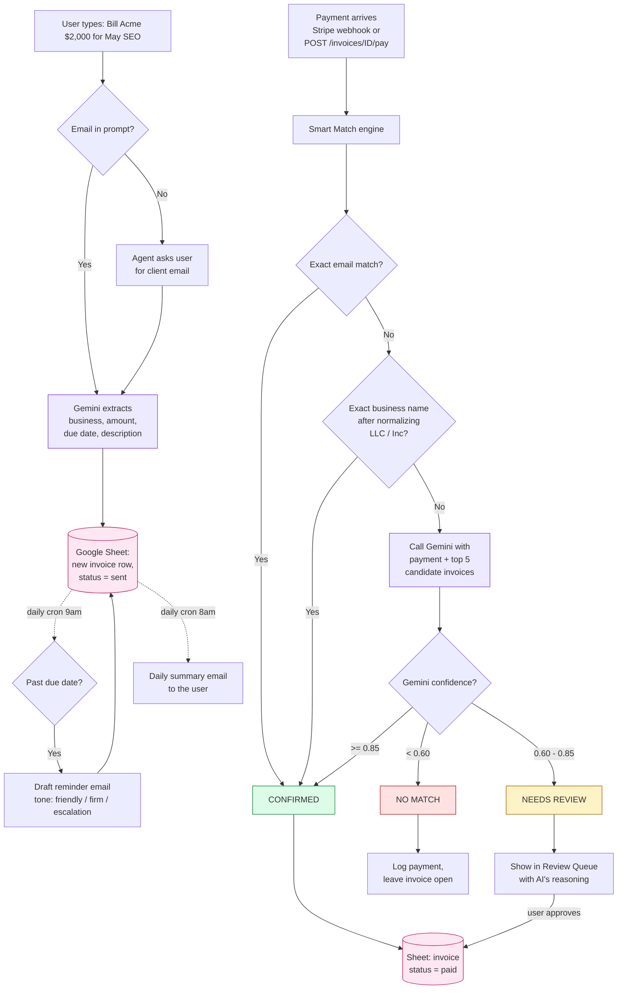

# AI Accounts Receivable Manager

An autonomous AI agent that does the work of a human Accounts Receivable manager for a B2B small or mid-sized company: creates invoices from a sentence, watches incoming payments, matches them to the right invoice using AI judgment, chases late payers on a schedule, and gives the user a daily brief.

Built for the Brain3 Level-1 assignment. Approved scope, then expanded with two value - natural-language invoice creation and live "pay this invoice" matching.

---

## What it actually does

Three flows, end to end:

**1. Create an invoice by talking**
- Type "Bill Acme Corp $2,000 for May SEO, due in 30 days"
- Gemini extracts the business, amount, description, due date
- If you didn't give a client email, the agent asks for one (it doesn't guess)
- New row lands in the Google Sheet, status `sent`

**2. A payment arrives**
- Either from a real Stripe webhook in production, or the "Simulate" buttons for the demo
- **Smart Match** runs a three-step cascade:
  1. Exact email match
  2. Exact business-name match (LLC/Inc/Corp normalized away)
  3. Gemini-judged fuzzy match with confidence + reasoning
- Outcomes: `confirmed` (auto-pay), `needs_review` (human approves), `no_match`
- Reconciliation safeguards catch partial payments, duplicates, already-paid invoices

**3. The agent acts on its own**
- Daily cron sweeps overdue invoices and drafts reminders (friendly → firm → escalation)
- Daily cron emails the user a one-page summary: collected, at-risk, needs-review, top high-risk clients
- A "Cash at Risk" panel on the dashboard flags clients with worsening payment patterns
- A "Recovered Revenue this month" counter turns the agent into an ROI story

The Google Sheet is the database, so the user can open it anytime and audit exactly what the agent did. No black box.

---

## Stack

| Layer | Tech | Why |
|---|---|---|
| Frontend | Next.js 15 + Tailwind | One repo, fast to ship, professional UI |
| Backend | FastAPI (Python 3.11+) | Async, typed, fast |
| AI | Google Gemini 2.5 Flash | Structured-output JSON for both matching and extraction |
| Database | Google Sheets via service-account auth | Demo-friendly, judge can watch it update live |
| Payments | Stripe sandbox + webhooks (real or simulated) | Free tier, deterministic for demo |
| Cron | GCP Cloud Scheduler (3 free jobs/mo, we use 2) | Free tier proactive actions |
| Hosting (planned) | Vercel + Render | Both free tier, both zero-config |

All APIs free, no credit card required.

---

## Architecture




### Smart Match flow

```
INVOICE -> WAIT -> PAYMENT -> SMART MATCH -> UPDATE -> NOTIFY
                                  ^
                             AI lives here
```

Smart Match cascade:
1. **Exact email** match (disambiguated by amount when multiple) → confirmed
2. **Exact business name** match (LLC/Inc/Corp normalized) → confirmed
3. **Gemini fuzzy judge** → confirmed (>=0.85), needs_review (0.60-0.85), or no_match (<0.60)
4. **Reconciliation safeguards** before any confirm: amount within 1%, not already paid, not duplicate

---

## Run it locally

You need:
- Python 3.11+
- Node.js 18+
- A Gemini API key from [Google AI Studio](https://aistudio.google.com/) (free, no card)
- A Google Sheet you own + a service-account JSON with Editor access on that sheet (or skip — the app falls back to in-memory storage)

### 1. Backend

```bash
cd backend
python -m venv .venv && source .venv/bin/activate
pip install -e ".[dev]"
cp .env.example .env       # fill in GEMINI_API_KEY at minimum
uvicorn app.main:app --reload --port 8000
```

Health check: `curl http://localhost:8000/health`
Interactive docs: <http://localhost:8000/docs>

### 2. Google Sheets (optional but recommended for the demo)

See [docs/GOOGLE_SETUP.md](./docs/GOOGLE_SETUP.md). Two paths:

- **Service account** (easier, no browser flow): create a service account, download its JSON key as `backend/service-account-key.json`, share your Google Sheet with the service account email as Editor, then set `GOOGLE_SHEETS_ID` and `GOOGLE_CREDENTIALS_PATH=./service-account-key.json` in `backend/.env`.
- **OAuth user creds**: download an OAuth client JSON as `backend/credentials.json`; the first request opens a browser for consent and caches a token.

When `GOOGLE_SHEETS_ID` is set, the app talks to your real sheet. When it's blank, it falls back to an in-memory store seeded with demo data on each startup.

### 3. Frontend

```bash
cd frontend
npm install
cp .env.local.example .env.local
npm run dev
```

Open <http://localhost:3000>.

### Tests

```bash
cd backend
.venv/bin/python -m pytest -q
```

16 tests: 10 BUILD_SPEC Smart Match cases + 4 cron-auth + 2 edge guards. All green.

---

## How to demo it

### Way 1: the dashboard (use this for the video)

The dashboard has two driver panels:

- **"Create an invoice by talking"** - type a sentence, get an invoice
- **"Simulate a payment"** - four scenarios that fire fake Stripe events:
  - **Clean match** - exact email, instant confirm
  - **Fuzzy match** - matching business name, different email
  - **Tricky (AI judges)** - garbled name + alias email; Gemini does the real reasoning
  - **Unknown payer** - random no-match (goes to Review Queue)

### Way 2: full lifecycle in one take

This is the demo arc the assignment is asking for:

1. Type `Bill DemoCo $1200 for May ad spend audit` → Create
2. Agent asks for the client email → type `finance@democo.com` → Continue
3. New invoice card appears (also visible as a new row in your Google Sheet)
4. Click the green **"Pay INV-XXXX"** button on the card
5. Smart Match confirms in ~2 sec → success badge with confidence + method
6. Refresh the Google Sheet — that row is now `paid`

That's: AI creates the invoice, AI matches the payment, Sheet auto-updates. No form, no human edit.

### Way 3: API directly

Browser: <http://localhost:8000/docs> for interactive Swagger. Useful calls:

```bash
# Create from natural language
curl -X POST http://localhost:8000/invoices/from-nl \
  -H "Content-Type: application/json" \
  -d '{"text":"Bill TechFlow $8500 for the Q2 mobile app rebuild, due in 30 days","email":"accounts@techflow.io"}'

# Simulate a payment for a specific invoice
curl -X POST http://localhost:8000/payments/simulate \
  -H "Content-Type: application/json" \
  -d '{"scenario":"pay_specific","invoice_id":"INV-0082"}'

# Run the daily summary cron (Cloud Scheduler would hit this at 8am)
curl -X POST http://localhost:8000/jobs/run-daily-summary \
  -H "Authorization: Bearer dev-secret"
```

---

## Layout

```
/frontend       Next.js app (App Router)
  /app          routes: /, /invoices, /review, /settings
  /components   AppShell, StatCard, ConfidenceBar, CreateInvoiceFromNL, SimulatePayment, ...
  /lib          api client, format helpers, shared types

/backend        FastAPI app
  /app
    main.py            app entry, lifespan, route registration
    config.py          pydantic-settings (env vars)
    models/            Invoice, Payment, MatchResult, DashboardStats
    routers/           invoices, payments, review, stats, webhooks, jobs
    services/          smart_match, reminder, daily_summary, stats
    integrations/      sheets (in-memory + Google), gemini
  /tests               pytest, conftest forces in-memory store
  pyproject.toml

/docs           SRS, BUILD_SPEC, GOOGLE_SETUP
/scripts        seed.py - generates ~75 invoices and ~20 payments
CLAUDE.md       project context for AI-assisted dev
```

---

## Demo script (5 minutes)

**0:00-0:30 - Hook**
> "Every B2B company has an Accounts Receivable function - someone chases late payments, matches them to invoices, reports to the CFO. For SMBs, that's a part-time job for a Controller or it falls on the founder. I built an AI agent that does it."

**0:30-1:30 - Dashboard tour**
> "Cash collected $X. Outstanding $Y. Cash at Risk $Z - flagged invoices 30+ days late. DSO 44 days - a CFO knows what that means. And **Recovered Revenue $88K this month** - money the agent matched and chased that probably wouldn't have come in on time."

Point at "Needs Your Review":
> "When the AI isn't sure, it asks me. The reasoning is right there so I can audit the call."

**1:30-3:00 - The end-to-end loop (the wow moment)**

Open the Google Sheet in a side tab. Then on the dashboard:
> "Watch this. I'll create the next invoice by talking."

Type: `Bill DemoCo $1200 for May ad spend audit`. Click Create.

> "The agent didn't make up an email - it asked. That's what makes it an agent, not a form."

Type the email, hit Continue. Switch to the Sheet tab, refresh:
> "New row in the database. Now I'll simulate the client paying."

Back to dashboard, click **Pay INV-XXXX**.
> "Smart Match runs - exact email, 100% confidence, confirmed."

Switch to the Sheet:
> "Status flipped to paid. End to end in 20 seconds, no human edit to the database."

**3:00-4:00 - The AI judgment moment**

Click **Tricky (AI judges)**:
> "Sometimes the email doesn't match and the business name is garbled. Gemini compares Polaris to Polaris Studio, amounts identical - 92% confidence, confirmed. That's the AI doing real work, not just pattern matching."

Then click an item in the Review Queue:
> "When confidence is lower, the agent never auto-pays. It asks me, shows its reasoning, and I approve with one click. That's what makes a CFO trust it."

**4:00-4:30 - The proactive part**
> "This all runs on a schedule too. Every morning the agent sweeps overdue invoices and drafts reminders. At 8am it emails me a one-page summary. I don't have to log in."

**4:30-5:00 - Architecture and close**
> "Next.js plus FastAPI plus Gemini plus Google Sheets - all free tier. The Sheet is the database, which means full audit trail. A human can open it and see exactly what the agent did. Replaces $5K to $15K a month of manual AR work plus $500/mo of legacy software. Same engine scales up. Thanks for watching."

---

## What's intentionally not built (1-day scope)

- Multi-tenant / accounts / login (single hardcoded user)
- ACH / Plaid / bank-feed integration (Stripe only)
- QuickBooks / Xero sync (CSV import + Sheets only)
- Auto-send to clients (drafts only - human approves)
- Mobile app
- Audit-grade accounting compliance

These are roadmap items, listed to show I know the boundary.

---

## Status

| Phase | Status |
|---|---|
| Setup | done |
| Backend foundation + Smart Match (TDD, 16/16) | done |
| Stripe webhook + cron services | done |
| Frontend: Dashboard, Invoices, Review Queue, Settings | done |
| Live Gemini integration | done |
| Live Google Sheets integration (service account) | done |
| NL invoice creation with email follow-up | done |
| Pay-specific demo flow | done |
| Push to GitHub | user |
| Record video | user |
