# AI Accounts Receivable Manager — 5-minute presentation

## 1. The problem (45 seconds)

Every B2B company has to chase payments. Someone has to:

- send invoices out
- watch which ones get paid
- figure out *who* paid when a payment arrives (the payer name and email often don't match the invoice cleanly)
- chase the ones that don't get paid
- summarize the week for whoever runs the business

In a small or mid-sized B2B (a 10–100 person company doing real revenue) this work falls on a Controller or an ops person, or — for a founder running things solo — on themselves. It's roughly $5K–$15K/month of human time. It's also the kind of work that gets pushed to Sunday night because there's always something more urgent during the week. Money sits uncollected. Late payments slip through. Cash flow suffers.

The work itself isn't complicated. It's repetitive, judgment-light, and almost entirely about pattern matching across messy real-world data. That's exactly the kind of work an AI agent can do.

---

## 2. The solution (45 seconds)

An autonomous agent that runs the AR function:

1. **Creates invoices** from a single sentence ("Bill Acme $2,000 for May SEO")
2. **Watches payments** as they arrive (Stripe webhook, or our `/pay` endpoint for demo)
3. **Matches each payment** to the right invoice using a three-step engine: exact email → exact business name → Gemini for the fuzzy/ambiguous cases
4. **Updates the database** automatically when confident, **asks a human** when not
5. **Chases late payers** on a daily schedule
6. **Emails the user a daily summary** with cash collected, cash at risk, and what needs attention

The database is a plain Google Sheet, so a human can open it anytime and audit exactly what the agent did. No black box.

---

## 3. System flow

```mermaid
flowchart TD
    A[User types: 'Bill Acme $2,000 for May SEO'] --> B{Email in prompt?}
    B -->|Yes| D[Gemini extracts:<br/>business, amount,<br/>due date, description]
    B -->|No| C[Agent asks user<br/>for client email]
    C --> D
    D --> E[(Google Sheet:<br/>new invoice row,<br/>status = sent)]

    E -.daily cron 9am.-> F{Past due date?}
    F -->|Yes| G[Draft reminder email<br/>tone: friendly/firm/escalation]
    G --> E

    H[Payment arrives<br/>Stripe webhook or<br/>POST /invoices/&#123;id&#125;/pay] --> I[Smart Match engine]

    I --> J{Exact email match?}
    J -->|Yes| CONF[CONFIRMED]
    J -->|No| K{Exact business name<br/>after normalizing<br/>LLC/Inc?}
    K -->|Yes| CONF
    K -->|No| L[Call Gemini with<br/>payment + top 5<br/>candidate invoices]
    L --> M{Gemini confidence?}
    M -->|>= 0.85| CONF
    M -->|0.60-0.85| REV[NEEDS REVIEW]
    M -->|< 0.60| NM[NO MATCH]

    CONF --> N[(Sheet: invoice<br/>status = paid)]
    REV --> O[Show in Review Queue<br/>with AI's reasoning]
    O -->|user approves| N
    NM --> P[Log payment,<br/>leave invoice open]

    N -.daily cron 8am.-> Q[Daily summary email<br/>to the user]
    P -.-> Q

    style D fill:#ede9fe,stroke:#7c3aed
    style L fill:#ede9fe,stroke:#7c3aed
    style CONF fill:#dcfce7,stroke:#15803d
    style REV fill:#fef3c7,stroke:#a16207
    style NM fill:#fee2e2,stroke:#b91c1c
    style E fill:#fce7f3,stroke:#be185d
    style N fill:#fce7f3,stroke:#be185d
```



Three things to point at in the diagram while presenting:

- **Purple boxes** — where Gemini is doing real work (extraction + judgment)
- **Pink boxes** — the Google Sheet (the single source of truth)
- **Green / yellow / red** — the three possible outcomes; the user only ever has to handle yellow

---

## 4. Demo walkthrough (3 minutes)

Open these tabs side by side: Dashboard · Google Sheet · `/docs`.

### A. Show the tests pass (15 sec)

```bash
cd backend && .venv/bin/python -m pytest -v
```

> "16 tests, all green. The matching engine has full TDD coverage before we ever click a button."

### B. Walk the dashboard (30 sec)

Point at the 4 KPIs: Collected · Outstanding · **Cash at Risk** · **DSO**. Then **Recovered Revenue this month** and the **High-Risk Clients** list.

> "These are the numbers a CFO looks at every Monday. The agent computes them straight from the Sheet."

### C. Create an invoice by talking (60 sec)

In the "Create an invoice by talking" box, type:

> Bill DemoCo $1,200 for May ad spend audit

Click **Create**. The agent asks for the email. Type `finance@democo.com`, hit **Continue**.

Switch to the Sheet, refresh. Show the new row at the bottom.

> "No form. The agent extracted the business, amount, description, due date. It even asked for the email when I didn't give one — it doesn't invent data."

### D. The four match cases via `/docs` (90 sec)

Open `/docs`, find **POST /invoices/{invoice_id}/pay**, click **Try it out**.

Use the payloads from [DEMO_PAYLOADS.md](./DEMO_PAYLOADS.md). For each:

1. Paste the JSON body, set the invoice ID, click Execute
2. Switch to the Sheet, refresh — show the row update
3. Switch to the Dashboard — show the KPIs update
4. Back to `/docs` for the next case

| Case | Effect |
|---|---|
| 🟢 Exact (INV-0048) | confirmed via `exact_email`, sheet → paid |
| 🟡 Fuzzy (INV-0063) | confirmed via `exact_business`, sheet → paid |
| 🟣 Smart (INV-0016) | **Gemini reasons**, confirmed via `fuzzy_ai`, sheet → paid |
| 🔴 Unknown (INV-0037) | `no_match`, sheet **unchanged**, payment logged for audit |

For the Smart case specifically:

> "Look at the reasoning sentence. That's Gemini doing what a human Controller would do — comparing 'Northwind' to 'Northwind Trading', deciding they're the same entity, returning a confidence score."

---

## 5. Close (15 sec)

> "Replaces five to fifteen thousand dollars a month of manual AR work, plus five hundred a month of legacy software like HighRadius. Same engine scales up to mid-market. Stack is Next.js, FastAPI, Gemini 2.5 Flash, Google Sheets — all free tier. Thanks for watching."

---

## What to keep in mind while presenting

- **Don't pitch. Show.** The diagram + the four live cases sell themselves.
- **Always switch to the Sheet after each match.** That's the line between "demo" and "real product."
- **The Smart case (Gemini) is the wow moment.** Pause on the reasoning sentence — let it land.
- **The Unknown case is the trust moment.** "The agent didn't guess. It flagged." A CFO needs to hear that.
