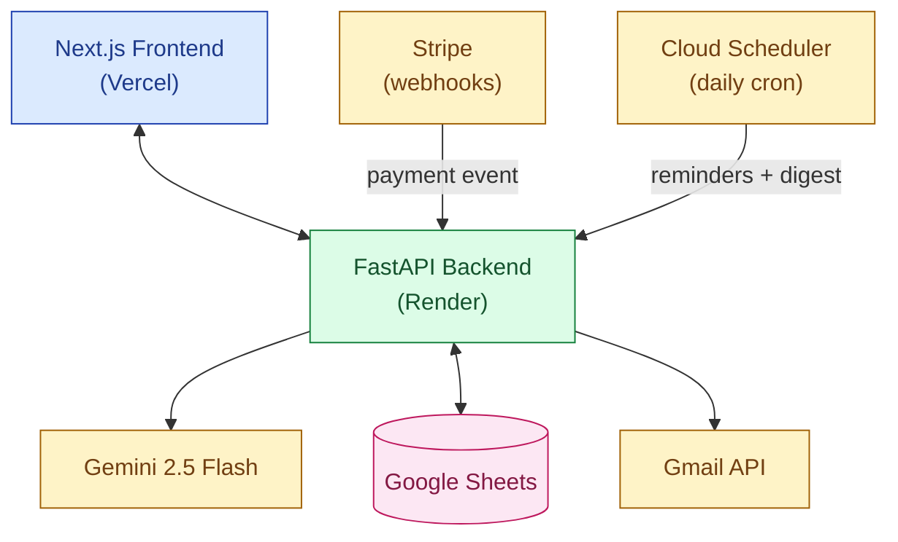

# AI Accounts Receivable Manager
**Solution Design - Brain3 Level-1**
Zerubabel · 2026-05-04 · for kidus@brain3.ai

---

## The pitch

An autonomous **AR Analyst** for B2B companies. It watches incoming payments, matches them to open invoices, chases unpaid ones with calibrated emails, and gives the user a daily "Cash at Risk" report.

It replaces a chunk of the manual AR work that today either falls on a Controller or on the founder doing it on a Sunday night. Targets the SMB to mid-market gap that's too small for HighRadius/Versapay and too big for spreadsheets.

---

## Why this role

- Late B2B payments are a known pain. Most SMBs feel it monthly and most have no real tool for it.
- Enterprise AR tools (HighRadius, Versapay, Billtrust) cost $500 to $5K per month and target Fortune 1000.
- Bookkeeping tools (QuickBooks, Xero) **track** invoices but don't **act** on them.
- That leaves a huge middle of B2B SMBs running AR on spreadsheets and Gmail. That's our user.

---

## What the agent does

```
INVOICE -> WAIT -> PAYMENT -> SMART MATCH -> UPDATE -> NOTIFY
                                  ^
                            AI lives here
```

**Core workflow:**
1. **Invoices** loaded from CSV or Sheets, tracked through 4 states: Sent, Overdue, Paid, At Risk.
2. **Reminders** sent on a cadence (Day 0, +7, +14, +30) by a daily Cloud Scheduler cron.
3. **Payments** arrive via Stripe webhook and trigger **Smart Match**.
4. **Smart Match** combines deterministic checks (email, name, phone) with Gemini judgment (fuzzy entity resolution + reconciliation in one step). Outputs one of: Confirmed, Needs Review, No Match.
5. **Daily digest** emailed to the user: collected, at-risk, needs-review, high-risk clients.

---

## Where the AI actually helps

This isn't just a chat box on top of Gemini. The AI is doing three things that plain code can't really do well:
- **Smart matching** - figuring out if "ABC Co" and "ABC Corporation LLC" are the same customer, with a confidence score and a short reason.
- **Risk scoring** - looking at a client's past payments and flagging the ones who keep paying late before they slip again.
- **Email drafting** - writing the follow-up emails in a tone that fits the client (softer for good payers, firmer for repeat offenders). I always approve before anything is sent.

---

## Architecture



**Stack:**
- **Frontend:** Next.js 15 + Tailwind + shadcn/ui
- **Backend:** FastAPI (Python) - async, typed, fast
- **AI:** Gemini 2.5 Flash (free tier)
- **DB:** Google Sheets (transparent and easy to demo)
- **Payments:** Stripe sandbox + webhooks
- **Email:** Gmail API
- **Cron:** GCP Cloud Scheduler (free)
- **Hosting:** Vercel (frontend) + Render (backend) - both free tier

---

## APIs (all free, no credit card)

| API | Purpose |
|---|---|
| Gemini 2.5 Flash | Matching, risk scoring, drafting |
| Google Sheets | Database |
| Stripe (sandbox) | Payment events |
| Gmail | Send emails |
| Cloud Scheduler | Daily reminders + digest |

---

## UI (4 screens)

1. **Dashboard** - Cash Collected, Outstanding, Cash at Risk, DSO + Review Queue + high-risk watchlist
2. **Invoices** - table, status badges, inline actions
3. **Review Queue** - AI's match + reasoning + Approve/Reject
4. **Settings** - connect Stripe/Gmail, configure cadence

---

## Why it wins on the evaluation criteria

- **Would I pay?** Replaces $5K+/mo of human AR with a $99 to $499/mo tool.
- **Would I hire AI over a human?** Yes for around 80% of AR work; the human only sees the Needs Review queue (the 20% that actually needs judgment).
- **Technical execution:** real multi-system integration, real webhooks, real cron, AI used for judgment not decoration.
- **Problem-solving:** a non-obvious B2B finance pain - not the crowded HR/social-media space the brief warns against.

---

## Out of scope (to keep the 1-day honest)

Multi-tenant, ACH/Plaid, QuickBooks sync, mobile, payment processing, audit-grade compliance.

---

## Approval ask

Kidus - does this scope and framing work? Anything you want me to focus on for the demo? I'll start building on your green light.
